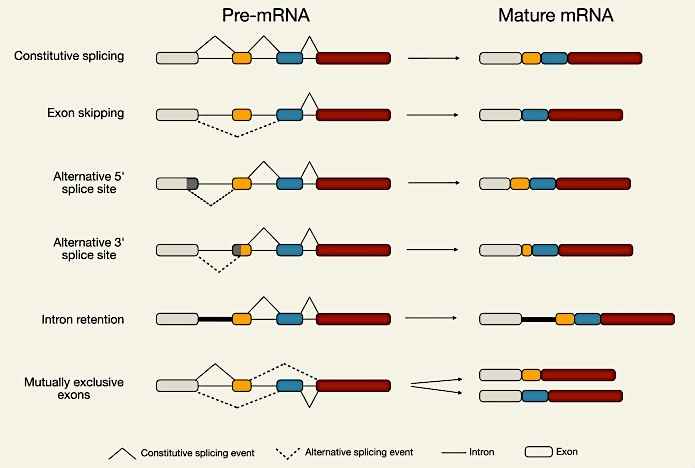

## SAC Proposal version 2 (Project 1)

### Introduction
1. Neoantigens are novel antigens derived from various mechanisms in tumor cells, recognized as 'nonself' by the immune system, and thus they play important roles in antitumor immune responses during immunotherapy

2. Neoantigens can be broadly classed into classical and noncanonical neoantigens (Figure 1)

3. Classical neoantigens are derived from nonsynonymous single nucleotide variants (SNVs), small insertion/deletions (indels) or gene fusions within exome that directly alter the translated protein sequences

4. Noncanonical neoantigens result from aberrant cellular processes in tumor cells such as alternative splicing and RNA editing, and they are not necessarily derived from cis mutation events

5. These alternative neoantigens are largely unexplored – they can result in tumor-specific and highly immunogenic neoepitopes, especially in tumor types with low tumor mutational burden (TMB), a proxy metric that is biased towards the classical, SNV-derived neoantigens

### Significance 

* Personalized neoantigen-based vaccine development targets a set of both unique, *private* neoantigens alongside recurrent, *public* neoantigens. 

* Such individually-tailored vaccine targets impose prohibitive logistical and financial contraints to widespread clinical accessibility (Pearlman et al., 2021), thus discovering shared tumor-specific neoantigens for an *off-the-shelf* immunotherapeeutic strategy may be more realistic

* Compiling a neoantigen database that also covers neoantigens from sources beyond SNVs would expand the space of neoantigen repertoire to inform future neoantigen-based therapeutic development

* Basing neoantigen discovery off a specific Asian population address genomic data inequity that is currently inherent in genomic precision medicine that is predominantly Western or European-centric (Tawfik et al., 2023)

* We have reasons to believe that neoantigen landscape might be different in Asian populations

**Project Objective** 
> **Identification of highly immunogenic and shared, public neoantigen candidates in Asian populations by harnessing neoantigen-producing sources beyond SNVs to expand neoantigen prediction space for a faster and more comprehensive clinical translation**

### Proposed Methodology
#### CRMY Public Neoantigen Discovery Pipeline

We have designed a Nextflow pipeline following a generalized neoantigen prediction framework (**Fig. 3**) to identify potential neoantigens derived from alternative tumor-specific sources of genomic and transcriptomic alterations as described previously. 

<em>Fig. 3: General in silico framework for cancer neoantigen identification (adapted from Xie et al., 2023)</em>

#### A. Aberrant Transcriptome Detection

The Nextflow pipeline is highly modular and would allow different prediction modules to be "plugged and played" as desired, based on a specific neoantigen-deriving aberrant source. Two aberrant neoantigen-producing mechanisms have been chosen as our primary focus in establishing an Asian cancer neoantigen database.

i. ***Gene fusion neoantigens (FNs)***: They represent the aberrant output of gene fusions caused by chromosomal genetic rearrangements via translocations, deletions, or inversions

ii. ***Alternative splicing-derived neoantigens (ASNs)***: We will focus on *aberrant* splicing events that produce neopeptides that are absent in normal cells

##### ***Gene Fusions***

* We optimized a gene fusion transcript calling using two published bioinformatics tools – `Arriba` (Uhrig et al., 2021) and `FusionCatcher` (Nicorici et al., 2014) - on RNA-seq data from our local breast cancer cohort, MyBRCA, and combined the fusion transcript calling output into a preliminary fusion transcript candidate list

* These would be filtered for tumor-specific and recurrent, public fusion transcripts using similar fusion transcript calling output obtained from sample-matched RNA-seq data of tumor-adjacent normal cells

##### ***Alternative Splicing Events***

* In general, there are five different processes involving alternative RNA splicing; exon skipping, alternative 5' splice site, alternative 3' splice site, exon mutual exclusion, and intron retention (**Figure 4**)

<em>Figure 4: Types of alternative RNA splicing (adapted from Verta & Jacobs, 2022)</em>

* Dysregulation in alternative RNA splicing is commonly found in tumor transcriptomes (Dvinge & Bradley, 2015), and tumor-specific intron retention splicing events contribute a significant proportion of neoantigen load in cancer (Smart et al., 2018). Novel exon-exon junctions (EEJs) could also potentially generate immunogenic peptides, and recurrent EEJ-derived neoepitopes that are tumor-exclusive have also been previously reported (Kahles et al., 2018).  

* Two candidate tools that can identify specific AS events, especially intron retention, are `spladder`, implemented in Python (Kehles et al., 2016), and `FRASER` (Mertes et al., 2021), packaged on Bioconductor for use in R environments. They take RNA-seq sequencing data as inputs and both have sufficient usage documentations.

#### B. Neoepitope:HLA Binding Prediction

The next major step in the *in silico* framework involves testing which of the predicted neoantigen has good predicted binding to the HLA molecules (MHC class I or MHC class II).

##### ***HLA Typing***

* Using a program developed for HLA typing on both whole exome sequencing (WES) and RNA-seq data, `HLA-HD` (Kawaguchi et al., 2017), applied on our myBRCA cohort WES data, a set of expressed HLA alleles would be acquired.

* The expressed HLA allele set would be collated cohort-wide to enable identification of public neoantigens recurrent amongst the patients in the cohort.

##### ***Peptide–MHC Binding Characterization***

* Using a suite of computational programs from `pVactools` (Hundal et al., 2020), each potential neoepitope derived from the identified tumor-specific neoantigens would be scored and characterized for its binding to different MHC molecules based on the cohort-wide expressed HLA allele set.

#### C. T-Cell Recognition Prediction ?

